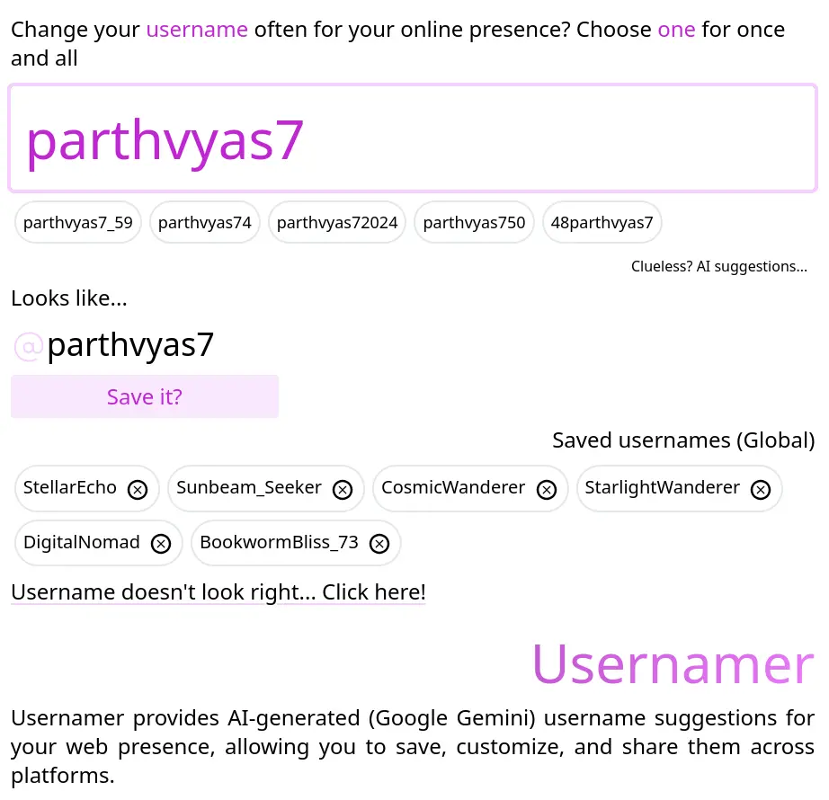

# Usernamer

Usernamer provides AI-generated (Google Gemini) username suggestions for your web presence, allowing you to save, customize, and share them across platforms.

# Demo

[Visit]()

## Screenshots

## Environment Variables

To run this project, you will need to add the following environment variables to your `.env` file

See `.env.sample`

## License

[MIT](https://choosealicense.com/licenses/mit/)
